<div align="center">



# Tranquil Automations

**Write plain JavaScript and run it against live browser tabs — the automation layer of [Tranquil Studio](https://github.com/tranquillabs/tranquil-client).**

</div>

---

> Part of the Tranquil toolkit, in early developer preview — see the [main repo](https://github.com/tranquillabs/tranquil-client) for status.

## What it is

`tranquil-automations` scripts live web apps from inside Tranquil Studio. Write a `.js` file and run
it against the active browser tab with **⌘⇧R** (whole file or a selection, REPL-style), or register
any `.js` as a named palette command. Scripts get a `tranquil` namespace with Puppeteer-backed page
control, background/off-screen pages, file I/O, and notifications. It also powers several tree-view
and tab UI enhancements.

## Features

- **Run JS against a live tab** — ⌘⇧R runs the whole file or the current selection.
- **`tranquil` namespace** — Puppeteer page control, background pages, file I/O, desktop notifications.
- **Named commands** — register any `.js` as an "Automations:" palette command.
- **Workspace UI** — vertical tab-list dock panel, tree-view row actions, folder-count pills, pane controls.

## Permissions

Every automation declares what it may reach, in the leading comment block. A script
without a `@permissions` line is refused.

```ts
// @permissions browser net=api.github.com
// @timeout 15m
```

| Grant | Allows |
| --- | --- |
| `none` | Nothing beyond the script's own folder |
| `browser` | Drive tabs — open pages and run code in them, in your signed-in sessions |
| `clipboard` | Read and write the system clipboard |
| `net=host,…` | Network access to those hosts |
| `read=path,…` / `write=path,…` | Files outside the script's folder |
| `env=NAME,…` | Environment variables |
| `run=bin,…` | Run commands (effectively full user privilege) |
| `import=host,…` | Module imports beyond `jsr.io` |

A script's own folder is always readable and writable. Anything requesting more asks for
approval the first time it runs, remembered until the declaration changes.

## Install

Bundled with Tranquil Studio. To run from source, follow the
[Local Dev Setup runbook](https://tranquillabs.dev/docs/v0.1.0/development/local-dev-setup).

## License

[MIT](LICENSE.md) © Tranquil Labs.
